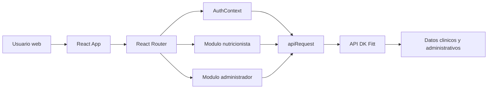

# PRD - DK Fitt Base Clinic

## 1. Resumen del producto

DK Fitt Base Clinic es una aplicacion web para equipos clinicos de nutricion. Centraliza el seguimiento de pacientes, planes nutricionales, alimentos, recetas, alertas, citas y actividad administrativa para que nutricionistas y administradores puedan operar la atencion diaria con mayor visibilidad y rapidez.

El producto esta construido como frontend React/Vite y consume una API externa configurable mediante variables de entorno. El alcance documentado en este PRD corresponde a las funcionalidades existentes en este repositorio frontend.

## 2. Objetivo

Permitir que una clinica nutricional gestione pacientes y su acompanamiento nutricional desde una interfaz unica, separando claramente las tareas clinicas del nutricionista y las tareas administrativas del sistema.

## 3. Usuarios objetivo

- Nutricionista: usuario clinico principal. Revisa dashboard, pacientes, fichas clinicas, planes, alimentos, recetas, seguimiento, alertas, citas y perfil propio.
- Administrador: usuario de gestion. Revisa indicadores generales, administra usuarios, crea nutricionistas, activa/desactiva cuentas, resetea contrasenas y consulta historial de actividad.
- Paciente: existe como rol reconocido por autenticacion, pero la plataforma web actual bloquea su acceso y muestra que es solo para administradores y nutricionistas.

## 4. Propuesta de valor

- Consolidar informacion clinica dispersa en vistas accionables.
- Reducir tiempo de revision con indicadores de adherencia, alertas y estado de planes.
- Facilitar la gestion de planes nutricionales semanales y recetas.
- Dar al administrador control sobre usuarios, cuentas y actividad del sistema.
- Mantener una experiencia visual calida, clara, profesional y apta para uso frecuente.

## 5. Alcance funcional

### 5.1 Autenticacion y sesion

El sistema debe permitir inicio de sesion con correo institucional y contrasena. Debe distinguir roles `admin`, `administrador`, `nutricionista` y `paciente`, normalizando `administrador` como `admin`.

Requisitos:

- Redirigir usuarios no autenticados a `/login`.
- Redirigir administradores a `/admin` y nutricionistas a `/`.
- Impedir acceso a rutas de otro rol.
- Bloquear el acceso web a usuarios con rol paciente.
- Persistir sesion en `localStorage`.
- Guardar access token, refresh token y datos basicos del usuario.
- Refrescar token cuando este cerca de expirar.
- Cerrar sesion localmente cuando el token expire o la API rechace la sesion.
- Cerrar sesion por inactividad despues de 15 minutos.
- Ejecutar logout remoto cuando exista refresh token.

### 5.2 Cambio obligatorio de contrasena

El sistema debe detectar cuentas que requieren cambio de contrasena temporal y forzar la ruta `/cambiar-contrasena`.

Requisitos:

- Detectar banderas de cambio obligatorio desde login y desde `/auth/me`.
- Pedir contrasena actual, nueva contrasena y confirmacion local.
- Validar nueva contrasena con minimo 8 caracteres, mayuscula, numero y caracter especial.
- Enviar al backend solo `contrasena_actual` y `contrasena_nueva`.
- Cerrar sesion despues del cambio exitoso.
- Redirigir a `/login?passwordChanged=true`.

### 5.3 Dashboard de nutricionista

El dashboard debe mostrar una vista semanal de seguimiento nutricional.

Requisitos:

- Mostrar KPIs de adherencia promedio, baja adherencia, planes activos y progreso semanal.
- Mostrar grafica de peso para hasta tres pacientes activos seleccionados.
- Guardar seleccion de pacientes de la grafica de peso en `localStorage`.
- Mostrar calorias planificadas vs consumidas de la semana.
- Mostrar tabla resumida de pacientes.
- Mostrar panel de alertas sin revisar.
- Refrescar datos al enfocar la ventana, al recibir eventos internos de actualizacion y de forma periodica.

### 5.4 Gestion de pacientes

El modulo de pacientes debe listar pacientes asignados/disponibles para nutricionista.

Requisitos:

- Consultar pacientes desde endpoints compatibles `/api/patients`, `/patients` o `/api/pacientes`.
- Mostrar nombre, estado de tratamiento, adherencia, ultima evaluacion y accion para ver detalle.
- Permitir busqueda por nombre.
- Permitir filtros por estado y adherencia.
- Navegar a ficha del paciente mediante `/pacientes/:id`.
- Mostrar estados vacios y mensajes de error cuando no se pueda cargar informacion.

### 5.5 Ficha del paciente

La ficha del paciente debe centralizar informacion clinica y operativa del paciente.

Requisitos:

- Cargar detalle del paciente desde endpoints de paciente.
- Organizar informacion en pestanas clinicas.
- Incluir resumen, perfil clinico, evaluaciones, consumo, planes, seguimiento, citas y alertas.
- Permitir navegar desde ficha a modulo de planes, citas o alertas cuando corresponda.
- Mostrar datos normalizados aunque la API use nombres alternativos para los mismos campos.

### 5.6 Planes nutricionales

El modulo de planes debe permitir revisar pacientes con seguimiento de plan y gestionar el plan nutricional del paciente.

Requisitos:

- Listar pacientes y estado del plan.
- Mostrar la fecha en que se genero por primera vez el plan del paciente.
- Navegar a `/planes/ver/:id`.
- Consultar planes por paciente mediante `/nutrition-plans/patient/{profileId}`.
- Consultar semanas mediante `/nutrition-plans/{planId}/weeks`.
- Mostrar plan semanal en una grilla reutilizable.
- Consultar platos/recetas desde `/dishes`.
- Actualizar platos de menus diarios.
- Generar recetas o semanas mediante endpoints de `recipe-generator`.
- Activar, suspender, reactivar, bloquear o desbloquear modulos de plan segun acciones disponibles.

### 5.7 Alimentos y recetas

El modulo de alimentos y recetas debe permitir consultar, crear, editar y eliminar alimentos y recetas, ademas de construir recetas.

Requisitos:

- Mostrar pestanas de Alimentos, Recetas y Constructor.
- Registrar nuevos alimentos desde la pestana Alimentos.
- Consultar alimentos de detalle desde `/alimentos-detalle` o `/api/alimentos-detalle`.
- Crear, editar y eliminar alimentos.
- Consultar recetas/platos desde `/dishes`.
- Crear recetas desde el constructor.
- Generar recetas por IA cuando el backend lo permita.
- Prevenir mensajes tecnicos al usuario cuando una receta no pueda eliminarse por haber sido usada en un plan nutricional.

### 5.8 Seguimiento

El modulo de seguimiento debe permitir revisar cumplimiento semanal de comidas y ejercicios por paciente.

Requisitos:

- Seleccionar paciente desde una lista con busqueda.
- Consultar seguimiento de comidas por fecha mediante `/meal-tracking/patient/{id}?fecha=YYYY-MM-DD`.
- Consultar seguimiento de ejercicios por fecha mediante `/exercise-tracking/patient/{id}?fecha=YYYY-MM-DD`.
- Mostrar cumplimiento alimentario, cumplimiento de ejercicio, calorias registradas y dias con registro.
- Mostrar detalle diario de comidas, calorias, hora y estado de cumplimiento.
- Mostrar graficas semanales de adherencia y calorias planificadas vs registradas.
- Permitir cambiar semana usando selector de fecha.

### 5.9 Alertas

El modulo de alertas debe permitir revisar alertas clinicas automaticas.

Requisitos:

- Consultar alertas desde `/alerts`.
- Filtrar por tipo, estado y paciente.
- Soportar tipos: adherencia, peso, consumo adicional, inactividad y exceso calorico.
- Mostrar contadores de alertas sin revisar, alta atencion, pacientes con alertas y revisadas/total.
- Mostrar detalle de alerta en panel lateral.
- Marcar alertas como revisadas mediante `/alerts/{id}/review`.
- Permitir abrir alertas filtradas por paciente desde otras vistas usando query params.

### 5.10 Citas

El modulo de citas debe permitir programar y dar seguimiento a consultas nutricionales.

Requisitos:

- Consultar citas desde `/appointments`.
- Consultar pacientes para seleccionar al crear cita.
- Mostrar calendario con dias que tienen citas.
- Crear citas mediante `/appointments`.
- Editar citas mediante `/appointments/{id}`.
- Cambiar estado mediante `/appointments/{id}/status`.
- Soportar estados: programada, atendida, cancelada y reprogramada.
- Impedir agendar citas en fechas pasadas.
- Impedir marcar como atendida antes del dia y hora de la cita.
- Separar historial pendiente de historial cerrado.

### 5.11 Perfil del nutricionista

El sistema debe permitir al nutricionista consultar y actualizar informacion de perfil cuando la API lo soporte.

Requisitos:

- Consultar perfil desde `/nutritionist-profile/me` o `/api/nutritionist-profile/me`.
- Consultar datos de sesion desde `/auth/me`.
- Permitir cambio de contrasena desde perfil mediante `/auth/change-password`.

### 5.12 Dashboard administrativo

El dashboard de administrador debe mostrar una vista general del sistema.

Requisitos:

- Consultar usuarios desde `/admin/users`.
- Consultar recetas activas desde `/dishes?activo=true&page=1&limit=100`.
- Consultar actividad desde `/admin/activity-logs`.
- Consultar pacientes desde `/patients`.
- Mostrar KPIs de nutricionistas, pacientes, pacientes con plan, pacientes sin plan y recetas.
- Mostrar crecimiento de pacientes por mes.
- Mostrar distribucion de pacientes con/sin plan.
- Mostrar actividad reciente.

### 5.13 Gestion de usuarios

El administrador debe poder gestionar cuentas de usuarios, especialmente nutricionistas.

Requisitos:

- Listar usuarios desde endpoints administrativos con fallback.
- Buscar por nombre o correo.
- Filtrar por rol.
- Crear nutricionista mediante `/api/admin/nutritionists`.
- Exigir nombres, apellidos, correo, registro profesional, fecha de nacimiento y sexo.
- Calcular edad desde fecha de nacimiento y validar rango 16-99.
- Crear cuentas con `requiere_cambio_contrasena: true`.
- Mostrar contrasena temporal devuelta por la API y permitir copiarla.
- Editar datos de nutricionista.
- Activar o desactivar cuentas.
- Resetear contrasena y generar nueva contrasena temporal.
- No permitir editar, desactivar o resetear cuentas administradoras desde la interfaz.

### 5.14 Historial de actividad

El administrador debe poder revisar el historial de actividad del sistema.

Requisitos:

- Consultar actividad desde `/admin/activity-logs`.
- Mostrar usuario, rol, accion y fecha/hora.
- Soportar estados de carga, vacio y error.

## 6. Arquitectura funcional

## 7. Rutas principales

| Ruta | Rol | Proposito |
| --- | --- | --- |
| `/login` | Publica | Inicio de sesion |
| `/cambiar-contrasena` | Autenticado | Cambio obligatorio de contrasena |
| `/` | Nutricionista | Dashboard clinico |
| `/pacientes` | Nutricionista | Gestion/listado de pacientes |
| `/pacientes/:id` | Nutricionista | Ficha del paciente |
| `/planes` | Nutricionista | Listado de planes por paciente |
| `/planes/ver/:id` | Nutricionista | Plan nutricional del paciente |
| `/alimentos` | Nutricionista | Alimentos, recetas y constructor |
| `/seguimiento` | Nutricionista | Seguimiento semanal |
| `/alertas` | Nutricionista | Alertas clinicas |
| `/citas` | Nutricionista | Gestion de citas |
| `/mi-perfil` | Nutricionista | Perfil del nutricionista |
| `/admin` | Admin | Dashboard administrativo |
| `/admin/usuarios` | Admin | Gestion de usuarios |
| `/admin/historial` | Admin | Historial de actividad |

## 8. Requisitos no funcionales

- Seguridad de sesion: rutas protegidas por autenticacion y rol.
- Inactividad: cierre automatico despues de 15 minutos sin actividad.
- Recuperacion de sesion: hidratacion desde token guardado y validacion contra `/auth/me`.
- Configurabilidad: URL base de API configurable con `VITE_API_URL` o `VITE_API_BASE_URL`.
- Resiliencia de API: varios modulos soportan endpoints alternativos para compatibilidad.
- Usabilidad: estados de carga, vacio y error en vistas dependientes de API.
- Accesibilidad visual: contraste legible, foco visible, soporte de modo claro/oscuro y reduccion de movimiento segun principios del producto.
- Responsividad: layouts adaptados a escritorio y pantallas pequenas mediante Tailwind y componentes responsivos.
- Mantenibilidad: componentes reutilizables basados en shadcn/Radix, React Query, React Router y utilidades compartidas.

## 9. Datos e integraciones

La aplicacion depende de una API REST externa. La URL por defecto apunta a `https://dk-fitt-api.onrender.com/api`, salvo que variables de entorno configuren otra base.

Principales dominios consumidos:

- Autenticacion: login, logout, refresh, me, change-password.
- Pacientes: listado y detalle.
- Dashboard: peso, calorias, alertas y pacientes.
- Evaluaciones clinicas: resumen y ficha de paciente.
- Planes nutricionales: planes por paciente, semanas, activacion, suspension y bloqueo/desbloqueo.
- Platos/recetas: dishes, menus diarios y generador de recetas.
- Alimentos: alimentos-detalle.
- Seguimiento: meal-tracking y exercise-tracking.
- Alertas: alerts y review.
- Citas: appointments y status.
- Administracion: users, nutritionists y activity-logs.

## 10. Criterios de aceptacion generales

- Un usuario sin sesion no puede ingresar a rutas protegidas.
- Un administrador no puede acceder a rutas de nutricionista y viceversa.
- Un usuario con contrasena temporal debe cambiarla antes de usar el sistema.
- El dashboard clinico carga indicadores, graficas y alertas con token valido.
- La lista de pacientes permite buscar, filtrar y navegar a ficha.
- Las vistas de planes muestran estado y fecha de primera generacion cuando la API entrega datos suficientes.
- Las alertas pueden filtrarse, inspeccionarse y marcarse como revisadas.
- Las citas pueden crearse, editarse y cambiar de estado respetando restricciones de fecha.
- El administrador puede crear nutricionistas y recibir la contrasena temporal para compartirla por canal seguro.
- El sistema muestra mensajes comprensibles para errores de carga o acciones fallidas.

## 11. Fuera de alcance actual

- Portal web para pacientes.
- Backend, base de datos o reglas server-side no presentes en este repositorio.
- Selector completo para vincular citas atendidas con evaluaciones clinicas.
- Creacion de pacientes desde el frontend, salvo que exista en backend pero no esta expuesta como flujo principal en este repositorio.
- Definicion formal de metricas de negocio externas al codigo.

## 12. Fuentes revisadas

- `PRODUCT.md`
- `src/App.tsx`
- `src/contexts/AuthContext.tsx`
- `src/lib/api.ts`
- `src/pages/Index.tsx`
- `src/pages/Pacientes.tsx`
- `src/pages/FichaPaciente.tsx`
- `src/pages/PlanesIndex.tsx`
- `src/pages/PlanesNutricionales.tsx`
- `src/pages/AlimentosRecetas.tsx`
- `src/pages/Seguimiento.tsx`
- `src/pages/Alertas.tsx`
- `src/pages/Citas.tsx`
- `src/pages/MiPerfil.tsx`
- `src/pages/admin/DashboardAdmin.tsx`
- `src/pages/admin/GestionUsuarios.tsx`
- `src/pages/admin/HistorialActividad.tsx`
- `src/components/alimentos/TabAlimentos.tsx`
- `src/components/alimentos/TabRecetas.tsx`
- `src/components/alimentos/TabConstructor.tsx`
